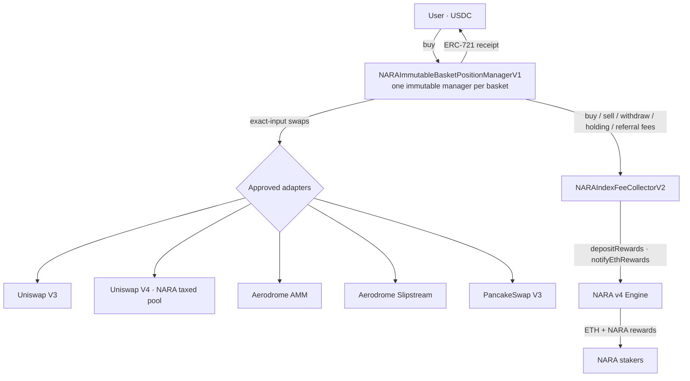

<div align="center">

# NARA Category Baskets

**One-click, on-chain category baskets on Base. Pay USDC, hold a self-custodied receipt NFT for the exact tokens, withdraw any time. Fees route to NARA stakers.**

[](https://soliditylang.org)
[](https://book.getfoundry.sh/)
[](#-build--test)
[](LICENSE)
[-orange)](#-status)

</div>

---

## What is this?

Most people don't want to research and buy ten tokens one by one. **NARA Baskets** lets a user pick a
*narrative* — `CORE`, `AI`, `FINANCE`, `CULTURE` — pay once in USDC, and receive a single
**ERC-721 receipt** representing the exact tokens bought for them. They can sell the whole basket back
to USDC or NARA, or withdraw the underlying tokens directly, at any time.

Every basket **must** include NARA. That's the design moat: **every basket buy is a NARA buy**, and
every fee routes back to NARA stakers.

```
        USDC in  ──▶  category basket exposure out  ──▶  sell back to USDC / NARA
                                   │
                                   ▼
                     fees route to NARA rewards (engine.depositRewards / notifyEthRewards)
```

It is deliberately **simple and immutable**: no owner, no pause, no upgrades, no admin sweep, no
rebalancing, no oracles. You get exactly what you bought, and you can always get it back out.

---

## Table of contents

- [Status](#-status)
- [How it works](#-how-it-works)
- [Architecture](#-architecture)
- [Contracts](#-contracts)
- [Fee model](#-fee-model)
- [Design principles](#-design-principles)
- [Repository layout](#-repository-layout)
- [Build & test](#-build--test)
- [Security](#-security)
- [Deployment](#-deployment)
- [Integration with NARA v4](#-integration-with-nara-v4)
- [Documentation](#-documentation)
- [License](#-license)

---

## 🚦 Status

**Pre-launch. No contracts are deployed to mainnet yet.** This repository is the audited-in-progress
source. Addresses will be published in [`docs/DEPLOYMENT_MANIFEST.md`](docs/DEPLOYMENT_MANIFEST.md)
only after a verified deployment.

> **Launch dependency:** NARA's liquidity home is a **taxed Uniswap v4 pool**
> (`NARALiquidityGrowthHook`). Production baskets **must** include `UniswapV4BasketAdapterV1` in the
> immutable adapter set so the NARA slice routes through that pool. See
> [`docs/NARA_INTEGRATION.md`](docs/NARA_INTEGRATION.md).

---

## ⚙️ How it works


| Step | What happens |
|------|--------------|
| **1. Buy** | User sends USDC. Approved swap adapters buy each basket asset at its target weight. |
| **2. Receipt** | The manager mints an **ERC-721** recording the exact token amounts bought for that user. |
| **3. Hold** | The position is the NFT. No staking, no rebalancing — the user owns precisely those tokens. |
| **4. Exit** | Sell the whole receipt back to USDC or NARA through approved adapters, **or** withdraw the underlying tokens directly. |
| **5. Fees → NARA** | Buy/sell/withdraw/holding/referral fees flow to the fee collector, which converts them and calls the NARA engine's reward functions. |

Underlying withdrawal is **always available** — even if every adapter were paused at the source DEX,
a holder can still pull their exact tokens out.

---

## 🏗 Architecture



- **One manager per basket** — assets, weights, payment tokens, adapters, fees and `feeRecipient`
  are fixed in the constructor and can never change.
- **Adapters are thin and immutable** — each pulls exactly `amountIn`, returns the real balance
  delta, and has no admin or upgrade path.
- **The fee collector is the only role-gated piece** — keepers (REDEEMER / SWAPPER /
  EXECUTOR_MANAGER) convert fees and push rewards through an allowlisted executor + explicit 4-byte
  selector. It can route value to the engine but cannot touch user positions.

---

## 📜 Contracts

### Canonical — deploy these

| Contract | Role |
|----------|------|
| [`NARAImmutableBasketPositionManagerV1`](src/NARAImmutableBasketPositionManagerV1.sol) | **The product.** One immutable manager per basket. ERC-721 receipt per position. No owner, roles, pause, sweep, rebalance, or mutable config. |
| [`NARAIndexFeeCollectorV2`](src/NARAIndexFeeCollectorV2.sol) | **Canonical fee collector.** Converts basket fees and routes them to the NARA engine. Role-gated keeper with allowlisted executor + selector. |
| [`adapters/UniswapV3BasketAdapterV1`](src/adapters/UniswapV3BasketAdapterV1.sol) | Exact-input swap adapter — Uniswap V3. |
| [`adapters/UniswapV4BasketAdapterV1`](src/adapters/UniswapV4BasketAdapterV1.sol) | **Required for production** — routes the NARA slice through NARA's taxed v4 pool. |
| [`adapters/AerodromeBasketAdapterV1`](src/adapters/AerodromeBasketAdapterV1.sol) | Exact-input swap adapter — Aerodrome AMM. |
| [`adapters/AerodromeSlipstreamBasketAdapterV1`](src/adapters/AerodromeSlipstreamBasketAdapterV1.sol) | Exact-input swap adapter — Aerodrome Slipstream (CL). |
| [`adapters/PancakeV3BasketAdapterV1`](src/adapters/PancakeV3BasketAdapterV1.sol) | Exact-input swap adapter — PancakeSwap V3. |

### Reference only — do **not** deploy for production

| Contract | Why it's here |
|----------|---------------|
| `src/NARABasketPositionManagerV1.sol` | Older **mutable** manager. Superseded by the Immutable manager. |
| `src/NARAIndexFeeCollectorV1.sol` | Superseded by V2. |
| `src/CategoryIndexSuiteV1.sol` | Separate **static pro-rata ERC-20 vault** module — *not* the one-click receipt product. |

---

## 💸 Fee model

Five fee surfaces, all **immutable and constructor-fixed**, all routed to the fee collector → NARA engine:

| Surface | Charged on | Notes |
|---------|-----------|-------|
| **Buy** | input token | hard cap **100 bps (1%)** |
| **Sell** | output token | hard cap **100 bps (1%)** |
| **Withdraw** | underlying | for direct underlying exits |
| **Holding** | position | time-based |
| **Referral** | split | pull-based, lifetime split to referrer |

Fees are configured per basket at deploy (hard cap **100 bps / 1%** per side) and shown before every
confirmation. Every receipt basket must include NARA at or above `MIN_NARA_WEIGHT_BPS`.

---

## 🧭 Design principles

**In V1, by design:** immutable config · ERC-721 receipts (not fungible NAV shares) · approved
adapters only · whole-basket sells · always-available underlying withdrawal · mandatory NARA
allocation · per-asset slippage + deadline checks · exact-transfer accounting.

**Intentionally _not_ in V1** (each needs separate design + audit): staking · lockups · auto-sell ·
stop-losses · governance · multisig custody · upgradeable vaults · lending · leverage · rebalancing ·
oracle-based mint/redeem · partial % sells · fungible ERC-20 shares · NAV/TWAP oracles.

---

## 🗂 Repository layout

```
nara-category-baskets-v1/
├── src/
│   ├── NARAImmutableBasketPositionManagerV1.sol   # canonical product
│   ├── NARAIndexFeeCollectorV2.sol                # canonical fee collector
│   ├── adapters/                                  # 5 exact-input swap adapters
│   └── …                                          # reference-only contracts
├── test/                                          # Foundry tests (136 passing)
├── script/
│   ├── DeployMainnetReady.s.sol                   # canonical deploy
│   └── VerifyDeployedBasket.s.sol                 # post-deploy verification
├── docs/                                          # integration, flow, security, manifests
├── foundry.toml                                   # solc 0.8.34 · cancun · via-ir
└── README.md
```

---

## 🔨 Build & test

Requires [Foundry](https://book.getfoundry.sh/getting-started/installation).

```bash
# install dependencies (deps are not vendored)
forge install foundry-rs/forge-std
forge install OpenZeppelin/openzeppelin-contracts

# build
forge build

# full non-fork suite (fast, no RPC) — 136 passing
forge test --no-match-path "test/AerodromeBasketAdapterV1.t.sol"

# everything, incl. fork tests (needs a Base RPC)
forge test --fork-url "$BASE_MAINNET_RPC_URL"

# CI profile (fuzz 1000 runs, invariant 256×64)
FOUNDRY_PROFILE=ci forge test
```

Toolchain: `solc 0.8.34`, `evm_version = cancun`, `via_ir = true`, optimizer `200` runs.

---

## 🔐 Security

This package is built to remove trust surfaces rather than add them:

- **No owner, no pause, no upgradeability, no admin sweep** on the receipt manager — once deployed, the
  basket config is permanent.
- **Underlying withdrawal is always available** — users can exit to their exact tokens unconditionally.
- **Fee collector cannot touch positions** — it can only convert fees and push rewards, through an
  allowlisted executor and an explicit 4-byte selector (no multicall/batch selectors).
- **Adapters are immutable** and verified to move exactly the accounted balance deltas.

Current analysis: **136 tests passing** (unit + fuzz + invariant), static analysis (Slither) clean of
new issues, and a pre-deploy [`docs/SECURITY_CHECKLIST.md`](docs/SECURITY_CHECKLIST.md) gate.
Automated tooling is necessary but not sufficient — an independent human/competitive review is planned
before mainnet value. See [`SECURITY.md`](SECURITY.md) for scope and disclosure.

> ⚠️ The immutable manager has **no post-deploy admin**. Get the constructor config right — it is
> permanent.

---

## 🚀 Deployment

```bash
forge script script/DeployMainnetReady.s.sol:DeployMainnetReady \
  --rpc-url "$BASE_MAINNET_RPC_URL" --broadcast --verify

forge script script/VerifyDeployedBasket.s.sol:VerifyDeployedBasket \
  --rpc-url "$BASE_MAINNET_RPC_URL"
```

`DeployMainnetReady` deploys the manager, the V2 fee collector, and all five adapters (including the
required v4 adapter). `ADMIN` is only the fee-collector role recipient and should be a **Safe/timelock,
not the deployer EOA**. `DeployBaseMainnet.s.sol` and `DeployBaseSepolia.s.sol` are legacy and
intentionally revert — do not use them. Record results in
[`docs/DEPLOYMENT_MANIFEST.md`](docs/DEPLOYMENT_MANIFEST.md).

---

## 🔗 Integration with NARA v4

This is a **standalone Foundry package** — not part of the NARA Hardhat protocol repo's compile path.
It integrates with the v4 engine only by passing deployed addresses through environment variables
(`NARA_ENGINE`, `NARA`, `USDC`, `WETH`) and calling:

```solidity
engine.depositRewards(amount);          // route NARA fees to stakers
engine.notifyEthRewards{value: amount}(); // route ETH fees to stakers
```

The v4 engine contracts are never modified from this package.

---

## 📚 Documentation

| Doc | What's inside |
|-----|---------------|
| [`docs/NARA_INTEGRATION.md`](docs/NARA_INTEGRATION.md) | Engine wiring, fee routes, deploy order, launch dependency |
| [`docs/RECEIPT_BASKET_FLOW.md`](docs/RECEIPT_BASKET_FLOW.md) | Canonical buy / sell / withdraw flow + execution checks |
| [`docs/EXAMPLE_BASKETS.md`](docs/EXAMPLE_BASKETS.md) | Basket configuration templates |
| [`docs/SECURITY_CHECKLIST.md`](docs/SECURITY_CHECKLIST.md) | Pre-deploy security gate |
| [`docs/DEPLOYMENT_MANIFEST.md`](docs/DEPLOYMENT_MANIFEST.md) | Recorded after every deployment |
| [`docs/VALIDATION_STATUS.md`](docs/VALIDATION_STATUS.md) | Current validation state |

---

## ⚠️ Disclaimer

NARA Baskets are **not investment products** — they are non-custodial smart-contract execution tools. A
basket is a fixed, immutable set of tokens; there is **no manager, no rebalancing, and no NARA custody
of your assets**. Your receipt is an ERC-721 NFT representing claim to specific tokens you can withdraw
yourself at any time (subject to those tokens transferring normally).

- **No investment advice.** Token prices can go to **zero**. NARA does not promise any return.
- **You hold the underlying.** Composition is set at deployment and cannot be changed; the contract has
  no admin.
- **You are responsible** for evaluating the tokens in each basket. NARA is not a fiduciary.
- **No tax advice** — consult your own advisor.

This README is software documentation, not an offer, solicitation, or financial promotion. Pre-launch:
nothing here is deployed to mainnet.

---

## Community & contact

- 🌐 Website: **[naraprotocol.pro](https://naraprotocol.pro)**
- 🟣 Farcaster: **@naraprotocol**
- 𝕏 Twitter/X: **[@NARA_protocol](https://x.com/NARA_protocol)**
- 🔐 Security: **security@naraprotocol.pro** (see [SECURITY.md](SECURITY.md))

---

## License

[MIT](LICENSE) © NARA Protocol
