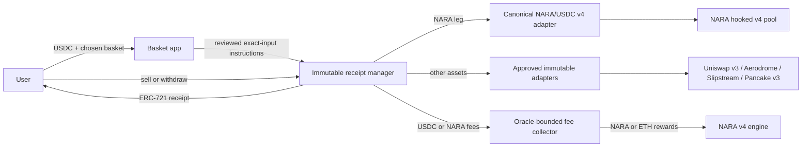

<div align="center">

# NARA — Category Baskets

**Immutable, receipt-based category baskets for Base.**

[](https://github.com/NARAProtocol/nara_protocol_v4_baskets/actions/workflows/ci.yml)
[](https://github.com/NARAProtocol/nara_protocol_v4_baskets/actions/workflows/codeql.yml)
[](https://soliditylang.org)
[](https://book.getfoundry.sh/)
[](LICENSE)

</div>

The NARA basket interface lets a user choose a predefined category, pay USDC, and receive an
ERC-721 receipt for the exact tokens acquired by an immutable basket manager.
The manager contract holds those tokens against the receipt until the owner
sells or withdraws them.

> [!WARNING]
> **Technical live testing upstream; basket app preview-only.** The canonical
> NARA v4 contracts and NARA/USDC pool use real assets on Base. Basket managers,
> the V2 fee collector, and the five-adapter production set are not deployed,
> so this app permits no basket purchase or exit writes. Do not use placeholder
> addresses, release-candidate tags, or an unverified manifest for deployment
> or value-bearing activity.

## Current status

| Surface | State |
|---|---|
| Immutable receipt manager | Implemented and tested |
| Five exact-input swap adapters | Implemented and tested |
| Canonical NARA v4 pool binding | Implemented and tested |
| Oracle-bounded fee collector | Implemented and tested |
| Basket app | Implemented; preview-only |
| Base basket deployments | Not deployed |
| Production manifests | Not available |
| Upstream Position NFT Phase-2 | Deployed, tested, source-verified, Safe-finalized; `integrationReady: false` |
| End-to-end candidate fork rehearsal | Required before deployment |
| Independent audit | Not performed |

The detailed evidence ledger is
[`docs/VALIDATION_STATUS.md`](docs/VALIDATION_STATUS.md). Status words in this
repository follow
[`docs/REPOSITORY_MAINTENANCE.md`](docs/REPOSITORY_MAINTENANCE.md).

## Verified design

- **One immutable manager per basket.** Assets, weights, payment tokens,
  adapters, fees, required NARA allocation, and fee recipient are fixed at
  construction.
- **Receipt-based ownership.** The ERC-721 records the exact underlying token
  amounts. Approval-based operators are disabled; only the literal receipt
  owner can sell or withdraw.
- **USDC-only Basket V1 entry.** ETH and WETH entry remain disabled until a
  separately implemented and reviewed composite route exists.
- **Canonical NARA route.** The required NARA adapter pins the fee, tick
  spacing, and hook in constructor immutables and rejects caller-supplied pool
  data.
- **Exact-input accounting.** The manager and adapters verify actual input and
  output balance deltas and enforce per-asset and total minimum output.
- **DEX-independent withdrawal.** A receipt owner can request recorded
  underlying tokens without a swap or keeper. A component token that blocks its
  own transfers can still block that token; selected-asset withdrawal preserves
  access to unaffected assets.
- **Narrow fee conversion.** Launch configuration sends only USDC or NARA to the
  collector. USDC conversion uses a typed USDC/WETH route with fresh price
  feeds, bounded slippage, exact spend checks, and delayed route changes.

## Architecture


```mermaid
flowchart LR
    U[User] -->|USDC + chosen basket| APP[Basket app]
    APP -->|reviewed exact-input instructions| M[Immutable receipt manager]
    M -->|NARA leg| V4[Canonical NARA/USDC v4 adapter]
    M -->|other assets| DEX[Approved immutable adapters]
    V4 --> POOL[NARA hooked v4 pool]
    DEX --> VENUES[Uniswap v3 / Aerodrome / Slipstream / Pancake v3]
    M -->|ERC-721 receipt| U
    M -->|USDC or NARA fees| FC[Oracle-bounded fee collector]
    FC -->|NARA or ETH rewards| E[NARA v4 engine]
    U -->|sell or withdraw| M
```

The basket package does not modify NARA v4 core contracts. It integrates only
through verified addresses and the engine reward interfaces documented in
[`docs/NARA_INTEGRATION.md`](docs/NARA_INTEGRATION.md).

The current documentation handoff is pinned to protected protocol merge
`dae88079dd336e22bdefde6f45e3b01389d554cb` under change ID
`NARA-20260830-documentation-convergence`. Contract identities and deployment
state still come from the verified manifests referenced by that commit.

## Canonical contracts

| Contract | Purpose |
|---|---|
| [`NARAImmutableBasketPositionManagerV1`](src/NARAImmutableBasketPositionManagerV1.sol) | Immutable basket configuration, exact accounting, receipt lifecycle, sell, and withdrawal |
| [`NARAIndexFeeCollectorV2`](src/NARAIndexFeeCollectorV2.sol) | Typed USDC conversion, direct NARA deposit, role separation, oracle bounds, and delayed route migration |
| [`UniswapV4BasketAdapterV1`](src/adapters/UniswapV4BasketAdapterV1.sol) | Required NARA slice through the immutable canonical hooked pool |
| [`UniswapV3BasketAdapterV1`](src/adapters/UniswapV3BasketAdapterV1.sol) | Exact-input Uniswap v3 route |
| [`AerodromeBasketAdapterV1`](src/adapters/AerodromeBasketAdapterV1.sol) | Exact-input Aerodrome AMM route |
| [`AerodromeSlipstreamBasketAdapterV1`](src/adapters/AerodromeSlipstreamBasketAdapterV1.sol) | Exact-input Aerodrome Slipstream route |
| [`PancakeV3BasketAdapterV1`](src/adapters/PancakeV3BasketAdapterV1.sol) | Exact-input PancakeSwap v3 route |

`NARAIndexFeeCollectorV1` and `CategoryIndexSuiteV1` remain reference-only and
are not part of the receipt-basket launch deployment.

## Repository layout

```text
.
├── app/                         # preview-first React/Vite basket app
├── config/launch-baskets.json   # contract/app composition parity source
├── docs/                        # integration, flow, security, and deployment evidence
├── script/                      # deployment and post-deployment verification
├── scripts/                     # repository-wide verification
├── src/                         # Foundry contracts
├── test/                        # unit, fuzz, invariant, and Base fork tests
├── foundry.toml
└── README.md
```

## Quick start

Requirements:

- Git
- Foundry `1.4.3`
- Node.js `22`
- npm

```powershell
git clone https://github.com/NARAProtocol/nara_protocol_v4_baskets.git
Set-Location nara_protocol_v4_baskets
git submodule update --init --recursive

& "$env:USERPROFILE\.foundry\bin\forge.exe" build
& "$env:USERPROFILE\.foundry\bin\forge.exe" test `
  --no-match-path "test/*Fork*.t.sol" `
  --no-match-contract NARAImmutableBasketPositionManagerV1InvariantTest

npm ci --prefix app
npm run check --prefix app
```

No wallet, private key, or RPC endpoint is required for the deterministic
contract and app gates.

## Canonical verification

On Windows:

```powershell
powershell -NoProfile -ExecutionPolicy Bypass -File scripts/verify.ps1
```

This verifies repository integrity, Action SHA pins, submodule pins, formatting,
bytecode limits, deterministic tests, CI-profile invariants, app parity, the app
production build, and High/Critical npm advisories.

Base fork tests are a separate environment-dependent gate:

```powershell
& "$env:USERPROFILE\.foundry\bin\forge.exe" test `
  --match-path "test/*Fork.t.sol" `
  --fork-url $env:BASE_RPC_URL
& "$env:USERPROFILE\.foundry\bin\forge.exe" test `
  --match-path "test/AerodromeBasketAdapterV1.t.sol" `
  --fork-url $env:BASE_RPC_URL
```

Never print, commit, or paste the RPC value.

## Basket app

The app lives in [`app/`](app/) and follows:

- [`app/AGENTS.md`](app/AGENTS.md) for implementation rules;
- [`app/DESIGN.md`](app/DESIGN.md) for its visual system;
- [`docs/UI_UX_NEUTRAL_ACTION_HIERARCHY.md`](docs/UI_UX_NEUTRAL_ACTION_HIERARCHY.md)
  for neutral, self-directed value-bearing actions.

Production buying stays disabled unless all basket statuses are explicit and
the verified deployment manifests match the app environment. See
[`app/README.md`](app/README.md).

## Deployment

The canonical deployment and verification entry points are:

- [`script/DeployMainnetReady.s.sol`](script/DeployMainnetReady.s.sol)
- [`script/VerifyDeployedBasket.s.sol`](script/VerifyDeployedBasket.s.sol)
- [`docs/DEPLOYMENT_MANIFEST.md`](docs/DEPLOYMENT_MANIFEST.md)
- [`docs/SECURITY_CHECKLIST.md`](docs/SECURITY_CHECKLIST.md)

Deployment requires explicit human authorization. The role admin, swapper, and
route manager must be distinct; the admin and route manager must be contracts.
Launch managers accept USDC only and use zero holding, raw-withdraw, and
referral-share fees.

## Documentation

| Document | Purpose |
|---|---|
| [`docs/README.md`](docs/README.md) | Documentation entry point |
| [`docs/NARA_INTEGRATION.md`](docs/NARA_INTEGRATION.md) | NARA v4 interfaces, fee routes, adapter binding, and deployment order |
| [`docs/RECEIPT_BASKET_FLOW.md`](docs/RECEIPT_BASKET_FLOW.md) | Buy, receipt, sell, withdrawal, and accounting behavior |
| [`docs/EXAMPLE_BASKETS.md`](docs/EXAMPLE_BASKETS.md) | Launch composition templates |
| [`docs/SECURITY_CHECKLIST.md`](docs/SECURITY_CHECKLIST.md) | Pre-deployment security gate |
| [`docs/DEPLOYMENT_MANIFEST.md`](docs/DEPLOYMENT_MANIFEST.md) | Sanitized deployment evidence schema |
| [`docs/VALIDATION_STATUS.md`](docs/VALIDATION_STATUS.md) | Current test and tooling evidence |
| [`docs/ROUND_FLOW_RELEASE_GATE.md`](docs/ROUND_FLOW_RELEASE_GATE.md) | Complete v4 round-flow release gate and unresolved deployment blockers |
| [`docs/releases/NARA-20260830-documentation-convergence.md`](docs/releases/NARA-20260830-documentation-convergence.md) | Current immutable protocol handoff, copy boundary, and verification record |
| [`docs/REPOSITORY_MAINTENANCE.md`](docs/REPOSITORY_MAINTENANCE.md) | Mandatory synchronization and change-control protocol |

## Security model

The receipt manager is immutable and has no owner, pause, upgrade, admin sweep,
or mutable route configuration. The fee collector is intentionally separate and
role-gated because it performs value conversion.

No automated or internal review guarantees the absence of defects. No
independent audit is claimed. Report suspected vulnerabilities privately using
[`SECURITY.md`](SECURITY.md).

## Current limitations

- No Base basket manager, adapter set, or collector deployment is published.
- No production app environment or basket manifest is available.
- `ForkBuyProof` still requires a candidate stack deployed on a local Base fork.
- Third-party tokens and DEX venues can pause, blacklist, revert, lose
  liquidity, or change behavior.
- The NARA hooked route supports exact-input swaps only.
- The app supports USDC entry only.
- Fee conversion depends on configured router and price-feed availability.
- Moderate transitive wallet-stack advisories remain documented in
  [`docs/VALIDATION_STATUS.md`](docs/VALIDATION_STATUS.md); the High/Critical
  audit gate currently passes.

## Legal notice

This repository provides experimental software and technical documentation. It
does not provide investment, legal, tax, or suitability advice, and nothing in
it is an invitation, inducement, or recommendation to acquire, hold, sell, or
use a token or basket. Basket tokens can lose all value. The receipt records
token amounts and contract-defined control paths for underlying tokens held by
the basket contract; this documentation makes no legal ownership or custody
characterization. It is not a promise of price, liquidity, return, protection,
or uninterrupted exit. This
repository contains no evidence of completed jurisdiction-specific qualified
legal review. Consumer activation or marketing requires written review for the
relevant entity, jurisdictions, audience, distribution route, disclosures, and
complete user journey.

## Community

- Website: [naraprotocol.pro](https://naraprotocol.pro)
- Farcaster: `@naraprotocol`
- X: [@NARA_protocol](https://x.com/NARA_protocol)
- Security: [security@naraprotocol.pro](mailto:security@naraprotocol.pro)

## License

[MIT](LICENSE) © NARA Protocol
